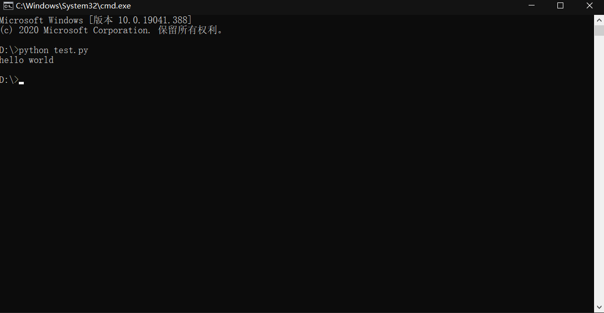

# Python_chapter 2

## 1.Python安装

### 1.1 windows环境

> 登录[python官网](https://www.python.org/) (https://www.python.org/)
>
> 
>
>  
>
> 下载好后，双击打开
>
> 

## 1.2 Mac OS环境

> 
>
> 
>
> * 往下翻，会找到：
>
>   

## 1.3 Linux环境

> ​	当前大多数的Linux发行版中都集成了python3，可以使用 `python3 --version` 命令来查看当前系统的python3的版本
>
> 

# 2 第一个Python程序

> 新建文本文件test.py ，输入：
>
> `print('hello world')`
>
> 在地址栏中输入 `cmd` 打开命令行，输入：
>
> `python test.py`
>
> 看看效果吧
>
> 
>
> 